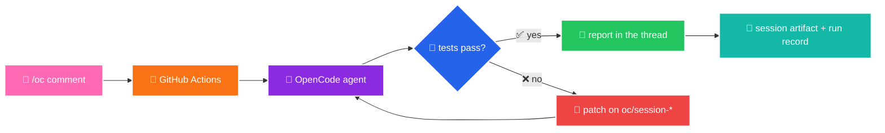

<div align="center">


# 🐉✨ SnapDragon ✨🐉

### *The GitHub-native [OpenCode](https://opencode.ai) agent that lives inside your repo*

Comment `/oc` on any issue or PR and the agent inspects, edits, tests and reports back —
straight from GitHub Actions, with durable sessions and automatic recovery. 🚀


🟥 🟧 🟨 🟩 🟦 🟪 🌈 🎆 🌈 🟪 🟦 🟩 🟨 🟧 🟥

**[Quick start](#-quick-start-5-steps)** •
**[How it flows](#-how-a-run-flows)** •
**[Cheat-sheet](#-ultimate-cheat-sheet)** •
**[Commands](#-commands)** •
**[Config](#%EF%B8%8F-configuration)** •
**[Verify](#-verify-a-checkout)**

</div>

---

> ### 🎤 “Talk to your CI like you'd text a friend.”
> One comment in, one full report out — plans, edits, tests, evidence. 🐉💬

> ⚡ **60-second TL;DR** — copy the wiring → add `OPENCODE_API_KEY` → drop `/oc hello` on an issue → read the report. 🎉

---

## ✨ Why it's nice

- 🗨️ **Zero setup per task** — just type `/oc fix the flaky test` in a comment.
- 🧠 **Durable memory** — long runs checkpoint, time out cleanly, and resume with `/oc continue`.
- 🔒 **Safe by default** — secrets are redacted from logs, sharing is disabled, no credentials in git.
- ⚡ **Fast & verified** — OpenCode installs from a sha256-verified release and is cached daily.
- 📈 **Fully observable** — live log stream, machine-readable run records, session artifacts.
- 🎁 **Batteries included** — cache warmer, PDF exporter and Dependabot ship in the box.
- 🌍 **Anywhere** — works on issues *and* PRs, queued per thread, results posted back in place.

---

## 🎬 How a run flows



---

## 🗂️ What's in the box

```text
opencode.json                     # 🐉 model, agent, MCP bridge, permissions
.opencode/
├── instructions.md               # 📜 the operator contract the agent follows
├── plugins/agentic-observability.js  # 📡 live event stream + secret redaction
└── package.json                  # 📦 @opencode-ai/plugin
.github/
├── workflows/opencode.yml        # 🎯 the /oc runner (issue + PR comments)
├── workflows/opencode-cache.yml  # 🧊 daily verified-binary cache warmer
├── workflows/pandoc-pdf.yml      # 🎁 bonus: Markdown → PDF via Pandoc
├── actions/oc-attempt/           # 🧪 one full agent attempt
└── scripts/                      # 🛠️ session state, context, publish, recovery
docs/
├── assets/                       # 🎨 banner art for this README
├── oc-runs/                      # 📈 run records (uploaded, never committed)
└── pandoc-demo/                  # 📄 PDF demo source
```

---

## 🚀 Quick start (5 steps)

**1️⃣ · Copy the wiring**
Bring over `opencode.json`, `.opencode/`, `.github/workflows/`, `.github/actions/`, and `.github/scripts/`.

**2️⃣ · Add the secrets** → *Settings → Secrets and variables → Actions*

| Secret | Required | Purpose |
| --- | --- | --- |
| `OPENCODE_API_KEY` | ✅ | model access for the agent |
| `UNIVERSAL_TOKEN` | ⚪ | PAT with cross-repo rights; falls back to `GITHUB_TOKEN` |
| `COMPOSIO_API_KEY` | ⚪ | enables the Composio MCP tool bridge |

**3️⃣ · Add the variables** (optional tuning)

| Variable | Default | Purpose |
| --- | --- | --- |
| `OPENCODE_MODEL` | `opencode/mimo-v2.6-flash-free` | which model runs |
| `OPENCODE_VERSION` | `1.18.32` | pinned, digest-verified OpenCode release |
| `COMPOSIO_USER_ID` | repo owner | Composio workspace identity |

**4️⃣ · Allow the operator**
The workflow only answers the repository owner — keep `.github/CODEOWNERS` pointing at your account.

**5️⃣ · Fire it up 🎉**

```bash
# on any issue or PR, as a comment:
/oc audit the repo and suggest three quick wins
```

---

## 🎮 Commands

| Command | What happens |
| --- | --- |
| `/oc <request>` | Run the agent on your request (also works as `/opencode`) |
| `/oc continue` | Resume a timed-out or paused run from its checkpoint |
| reply with the answer | If the agent asks for clarification, answer then `/oc continue` |

Runs queue per issue/PR (no parallel stomping), allow up to ~5.5 h of agent time,
and post their result back to the same thread.

> 💡 **Tip:** short and specific beats long and vague — `/oc fix test-foo flake` flies.

---

## 🏆 Ultimate cheat-sheet

| 🎨 | 🛠️ | What you get | 🌟 |
| --- | --- | --- | --- |
| 💬 **Talk** | `/oc <anything>` on an issue or PR | a full report in the same thread | 🌟🌟🌟 |
| 🔁 **Resume** | `/oc continue` | timed-out runs pick up where they stopped | 🌟🌟🌟 |
| 👀 **Watch** | Actions tab | live `tool ->` log stream, secrets redacted | 🌟🌟 |
| 🔍 **Audit** | run-record artifact + `oc/session-*` | every run leaves a paper trail | 🌟🌟 |
| 📄 **Export** | `pandoc-pdf.yml` | Markdown → PDF with one push | 🌟 |
| 🧊 **Speed** | `opencode-cache.yml` | digest-verified binary, warmed daily | 🌟 |

---

## ⚙️ Configuration

- **`opencode.json`** — model, default `build` agent, `permission: allow`, `share: disabled`, and the local `mcp-remote` bridge for Composio.
- **`.opencode/instructions.md`** — the operator contract: interpret the request yourself, inspect before modifying, verify with real evidence, never invent results.
- **`.opencode/plugins/agentic-observability.js`** — streams `tool ->`, `edited`, and error events into the Actions log and strips anything that looks like a token.
- **Version pinning** — bump `OPENCODE_VERSION` to move the whole fleet to a new release; the digest check keeps it honest.

---

## 📊 Observability & recovery

- 🧾 Every run writes a schema-stable record to `docs/oc-runs/<run_id>.json` and uploads it as an artifact (never committed).
- 💾 Native OpenCode sessions are exported, uploaded (90-day artifact), and restored on the next attempt.
- 🌿 Session state survives on a dedicated `oc/session-*` branch, so a re-trigger never restarts finished work.

---

## ✅ Verify a checkout

```bash
for t in .github/scripts/test-*.sh; do bash "$t"; done
```

---

## 🧰 Good to know

- 🤖 `dependabot.yml` keeps GitHub Actions (and npm) dependencies fresh.
- 📄 `pandoc-pdf.yml` renders `docs/pandoc-demo/**` to PDF on push to `main`.
- 🚫 Never commit `.env`, tokens, or session credentials — `.gitignore` already blocks the usual suspects.

---

<div align="center">

🟥 🟧 🟨 🟩 🟦 🟪 🌈 🎆 🌈 🟪 🟦 🟩 🟨 🟧 🟥

**Made for people who'd rather talk to their CI than their keyboard.** 🐉💬

*Say `/oc` and see what it can do.* 🎉


</div>
